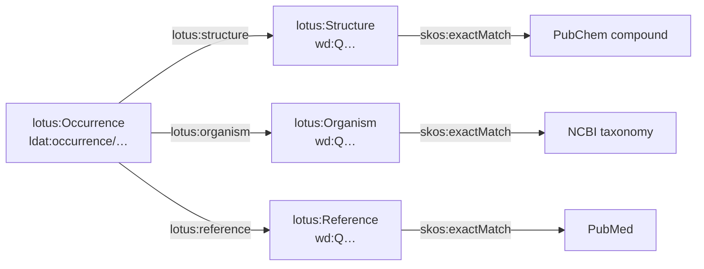

# LOTUS RDF schema (draft for RDF Portal)

Draft schema for hosting [LOTUS](https://lotus.nprod.net/) — referenced
structure–organism occurrences of natural products — as an RDF Portal database.
Written for the DBCLS staff who would load the graph and for whoever writes its
MIE file afterwards.

Status: **draft, not yet reviewed by DBCLS or by the LOTUS team.** Namespaces,
the graph name and the endpoint assignment are all proposals. See
[Open questions](#open-questions).

## Why convert the CSV instead of querying Wikidata

LOTUS data lives in Wikidata and LOTUS publishes no RDF of its own — its
releases are frozen CSV tables on Zenodo (v11 = 2026-04-13, DOI
[10.5281/zenodo.19360665](https://doi.org/10.5281/zenodo.19360665), CC-BY-4.0),
regenerated from live Wikidata by the project's own `lotus_exporter.py`.

Querying Wikidata live was measured and rejected for three reasons:

* **No graph to pin.** LOTUS is not a named graph in Wikidata but a query
  pattern (a compound with an InChIKey, a `P703` "found in taxon" statement, a
  `P248` reference on that statement). TogoMCP's correctness convention —
  every query pins its graph — has nothing to pin, and the subset boundary is
  a pattern that also admits non-LOTUS community edits.
* **Timeouts.** Wikidata's endpoint cuts every query at 60 s. Six of twelve of
  LOTUS's own published example queries hit that limit on 2026-09-15.
* **No version.** The live data has no version string, so an answer cannot be
  reproduced or cited. The frozen CSV has both a version and a date.

A converted graph fixes all three: one named graph, DBCLS-controlled
performance, and a `pav:version` in the data.

## A release ships two tables, and they disagree

The metadata table carries every attribute, but the **core table is
authoritative for which triples the release contains**. In v11 the core table
holds 48 `(structure, organism, reference)` triples the metadata table never
mentions, and flags 2 manually-validated triples the metadata table leaves
unflagged. The metadata table contains nothing the core table omits.

So a conversion needs both files: `--metadata` for the attributes, `--core` for
completeness. Converting from the metadata table alone loses those 48
occurrences with no error and no warning — 0.007% of the data, which is exactly
the size of defect that never gets noticed.

Entities reached only through the core table are thin: it carries just an
InChIKey, an organism name and a DOI. That is the deliberate trade — an
occurrence with three attributes can be enriched later, a missing one is
invisible.

## Identity and namespaces

| Prefix | IRI | Use |
| --- | --- | --- |
| `lotus:` | `http://rdfportal.org/ontology/lotus#` | classes and properties |
| `ldat:` | `http://rdfportal.org/dataset/lotus/` | minted occurrence IRIs |
| `wd:` | `http://www.wikidata.org/entity/` | structures, organisms, references |

Named graph: `http://rdfportal.org/dataset/lotus`

**Entities keep their Wikidata IRIs.** A structure is `wd:Q100138042`, not a
minted LOTUS IRI. This is the single most important decision in the schema: it
makes the graph joinable to Wikidata and to IDSM's Wikidata compound mirror
(already in TogoMCP as `idsm`) with no mapping table, and it survives a
re-conversion of a later release unchanged.

Only occurrences are minted, deterministically from the three QIDs:

```
ldat:occurrence/Q100138042_Q1709343_Q44391663
```

so re-running the converter on the same release reproduces byte-identical IRIs,
and two releases can be diffed directly.

## Model



An **occurrence** is the unit of assertion: *this structure was reported in this
organism by this reference*. It is a first-class node rather than a
`structure → organism` edge because the reference is not decoration — it is the
evidence, and the same structure–organism pair is typically reported by several
papers (672,413 occurrences over 227,256 structures and 37,486 organisms in
v11).

### `lotus:Occurrence`

| Property | Range | Notes |
| --- | --- | --- |
| `lotus:structure` | `lotus:Structure` | exactly 1 |
| `lotus:organism` | `lotus:Organism` | exactly 1 |
| `lotus:reference` | `lotus:Reference` | exactly 1 |
| `lotus:manuallyValidated` | `xsd:boolean` | **emitted only when true** (178 of 672,413 in v11) |

`manual_validation` is `Y` or `NA` in the CSV, where `NA` means "not manually
checked", not "checked and rejected". Emitting `false` for it would assert
something the source does not say, so the property is absent instead. Any query
counting validated occurrences must therefore not expect it on every node.

### `lotus:Structure` (subject: `wd:Q…`)

Coverage is the share of the 227,256 structures carrying the property.

| Property | Range | Coverage |
| --- | --- | --- |
| `lotus:inchikey` | `xsd:string` | 100% |
| `lotus:inchi` | `xsd:string` | 100% |
| `lotus:smiles` | `xsd:string` | 100%, isomeric |
| `lotus:smiles2D` | `xsd:string` | 100% |
| `lotus:molecularFormula` | `xsd:string` | 100% |
| `lotus:exactMass` | `xsd:decimal` | 100% |
| `lotus:stereocenterCount` / `lotus:unspecifiedStereocenterCount` | `xsd:integer` | 100% |
| `lotus:xlogp` | `xsd:decimal` | 99.7% |
| `lotus:traditionalName` | `xsd:string` | 96.9%, also `rdfs:label` |
| `lotus:iupacName` | `xsd:string` | 96.6% |
| `lotus:npclassifierPathway` / `…Superclass` / `…Class` | `xsd:string` | 97.1% / 91.5% / 88.6%, **repeatable** |
| `lotus:classyfireKingdom` / `…Superclass` / `…Class` / `…DirectParent` | `xsd:string` | 98.6% / 98.6% / 97.9% / 83.2% |
| `lotus:chemontId` | `xsd:string` | 98.6%, as `CHEMONTID:0002518` |
| `lotus:pubchemCompoundId` | `xsd:string` | 97.3% |
| `skos:exactMatch` | IRI | 97.3%, PubChem compound |

The three NPClassifier properties are **repeatable**: a compound with a mixed
biosynthetic origin packs its classes into one CSV cell as
`Fatty acids $ Polyketides` (up to 11.6% of rows), and the converter splits
them into separate triples. A query filtering on a single value therefore
matches co-classified compounds too — which is the correct behavior, and the
opposite of what the raw CSV gives you.

`lotus:chemontId` stays a literal because ChemOnt has no agreed resolvable IRI
namespace. Minting one is an open question below.

### `lotus:Organism` (subject: `wd:Q…`)

Coverage is the share of the 37,486 organisms carrying the property.

| Property | Range | Coverage |
| --- | --- | --- |
| `lotus:scientificName` | `xsd:string` | 100%, also `rdfs:label` |
| `lotus:gbifTaxonId` | `xsd:string` | 98.1% |
| `lotus:ottTaxonId` | `xsd:string` | 97.8% |
| `lotus:ncbiTaxonId` | `xsd:string` | **78.0%** |
| `lotus:taxonDomain` … `lotus:taxonVarietas` | `xsd:string` | 0.7–97.2%, see below |
| `skos:exactMatch` | IRI | 78.0%, `http://identifiers.org/taxonomy/<taxid>` |
| `rdfs:seeAlso` | IRI | 98.1%, GBIF species page |

**Only 78% of organisms have an NCBI taxon id**, so a query that joins through
`skos:exactMatch` into the `taxonomy` database silently drops 8,252
organisms. Prefer GBIF or OTT coverage when completeness matters more than
reaching the NCBI tree, and say which one an answer used. (Per *row* the NCBI
figure looks like 86.6%; the well-studied organisms appear in many more rows.
Per-entity is the honest number.)

The rank path is ten flat properties (`taxonDomain`, `taxonKingdom`,
`taxonPhylum`, `taxonClass`, `taxonOrder`, `taxonFamily`, `taxonTribe`,
`taxonGenus`, `taxonSpecies`, `taxonVarietas`) carrying **names, not IRIs**,
because that is all the CSV has. Coverage is uneven by rank — `taxonTribe` is
present on 44.7% of organisms and `taxonVarietas` on 0.7% — so a clade rollup should
group on the rank it actually needs and treat absence as unknown, not as
exclusion.

For real hierarchy traversal, join `skos:exactMatch` into RDF Portal's
`taxonomy` database and walk `rdfs:subClassOf*` there. That is the intended
division of labor: LOTUS supplies occurrences, `taxonomy` supplies the tree.

### `lotus:Reference` (subject: `wd:Q…`)

Coverage is the share of the 91,426 references carrying the property.

| Property | Range | Coverage |
| --- | --- | --- |
| `lotus:doi` | `xsd:string` | 99.96% (91,386 of 91,426) |
| `rdfs:seeAlso` | IRI | 100%, `https://doi.org/<doi>`, percent-encoded |
| `lotus:title` | `xsd:string` | 99.7%, `--refs-nt` only, also `rdfs:label` |
| `lotus:publishedIn` | IRI (`wd:Q…`) | 99.2%, `--refs-nt` only |
| `lotus:publicationDate` | `xsd:date` | 99.1%, `--refs-nt` only |
| `lotus:pmid` | `xsd:string` | 47.1%, `--refs-nt` only |
| `lotus:pmcid` | `xsd:string` | 5.0%, `--refs-nt` only |
| `skos:exactMatch` | IRI | 47.1%, PubMed, from the PMID |

Fewer than half the references carry a PMID, so joining LOTUS to RDF Portal's
`pubmed` database reaches at most 43,075 of the 91,426 papers. The DOI is the
complete identifier here; the PMID is the joinable one.

Titles, dates and PMIDs are **not in the CSV**, despite the Zenodo description
claiming the metadata table carries PMID and PMCID. They are folded in from a
Wikidata export by `--refs-nt`; without it, references have only a DOI.

Percent-encoding the DOI IRI is not cosmetic: Wiley DOIs such as
`10.1002/1099-0690(200104)2001:8<1459::AID-EJOC1459>3.0.CO;2-0` contain `<`
and `>`, which terminate an N-Triples IRI early. Two lines in nine million were
malformed before this was fixed, and every one of the other 9,094,796 parsed
fine — exactly the kind of defect a spot check misses.

## Vocabulary

The 48 `lotus:` terms are defined in
[lotus_ontology.ttl](lotus_ontology.ttl) — `rdfs:label`, `rdfs:comment`,
`rdfs:domain` and `rdfs:range` on each of 4 classes and 44 properties, 290
triples in all — and the converter emits them **into this same named graph, by
default**.

They go in the data graph rather than a graph of their own because every
TogoMCP query pins its graph: a vocabulary in a second graph is invisible under
that pin, so schema discovery through SPARQL (`?p rdfs:comment ?c`) would
return 0 rows and the properties would look undocumented. RDF Portal's
`taxonomy` graph already does it this way, carrying the DDBJ taxonomy TBox
inline with 2.8 M instance triples (1 `owl:Ontology`, 4 `owl:Class`, 7
`owl:ObjectProperty`, 28 `owl:DatatypeProperty`, checked live 2026-09-16). The
portal does host standalone ontology graphs at
`http://rdfportal.org/ontology/<name>` — `go`, `mondo`, `hp`, `efo`, `uberon`
and the rest — but those are third-party ontologies with an independent
existence and many consumers; this one is private to a single graph.

The comments carry the traps, so an agent reading the schema through SPARQL
learns the same things the MIE file will tell it:

* `lotus:manuallyValidated` is **absent, not false**, when an occurrence was
  not checked — so count unvalidated occurrences by absence, never by `false`.
* `lotus:ncbiTaxonId` reaches only 78.0% of organisms, so the `taxonomy` join
  drops 8,252 of them silently.
* `lotus:inchikey` and the three `lotus:npclassifier*` properties are
  **repeatable**, and are deliberately not declared `owl:FunctionalProperty`.
  The only functional properties are `lotus:structure`, `lotus:organism` and
  `lotus:reference`, which are single-valued by construction.

The vocabulary is versioned separately from the data (`owl:versionInfo "1.0"`
against the release's `pav:version "v11"`): it is hand-authored prose with its
own review cycle, and a fix to a comment should not require re-converting a
1.3 GB file.

### Dataset metadata

```turtle
<http://rdfportal.org/dataset/lotus> a void:Dataset ;
    dcterms:title "LOTUS natural products occurrences" ;
    pav:version "v11" ;
    dcterms:issued "2026-04-13"^^xsd:date ;
    pav:retrievedFrom <https://doi.org/10.5281/zenodo.19360665> ;
    pav:createdOn "2026-09-16T00:14:19Z"^^xsd:dateTime ;
    void:sparqlEndpoint <https://rdfportal.org/primary/sparql> .
```

This block is the reason for the whole exercise. A 2026 survey of RDF Portal
found only 13 of 37 databases exposing any version string; LOTUS should ship
with one from day one, so an answer can be attributed to a release.

## Example instance

```turtle
ldat:occurrence/Q100138042_Q1709343_Q44391663
    a lotus:Occurrence ;
    lotus:structure wd:Q100138042 ;
    lotus:organism  wd:Q1709343 ;
    lotus:reference wd:Q44391663 .

wd:Q100138042 a lotus:Structure ;
    rdfs:label "(+)-Annonacin" ;
    lotus:inchikey "MBABCNBNDNGODA-WGCJABNLSA-N" ;
    lotus:molecularFormula "C37H66O7" ;
    lotus:exactMass "622.48085444"^^xsd:decimal ;
    lotus:npclassifierPathway "Polyketides" ;
    lotus:npclassifierClass "Acetogenins" ;
    lotus:pubchemCompoundId "441555" ;
    skos:exactMatch <http://rdf.ncbi.nlm.nih.gov/pubchem/compound/CID441555> .

wd:Q1709343 a lotus:Organism ;
    rdfs:label "Annona muricata" ;
    lotus:taxonFamily "Annonaceae" ;
    lotus:ncbiTaxonId "13337" ;
    skos:exactMatch <http://identifiers.org/taxonomy/13337> .

wd:Q44391663 a lotus:Reference ;
    lotus:doi "10.1055/S-2003-38485" ;
    lotus:pmid "12677528" ;
    lotus:publicationDate "2003-03-01"^^xsd:date ;
    skos:exactMatch <http://rdf.ncbi.nlm.nih.gov/pubmed/12677528> .
```

## Example queries

All four were run against the converted v11 graph and return rows.

```sparql
# Compounds reported in Annona muricata, with the paper that reports each
PREFIX lotus: <http://rdfportal.org/ontology/lotus#>
PREFIX rdfs: <http://www.w3.org/2000/01/rdf-schema#>
SELECT ?name ?inchikey ?doi
FROM <http://rdfportal.org/dataset/lotus>
WHERE {
  ?occ lotus:organism <http://www.wikidata.org/entity/Q1709343> ;
       lotus:structure ?s ; lotus:reference ?ref .
  ?s lotus:inchikey ?inchikey ; rdfs:label ?name .
  ?ref lotus:doi ?doi .
}
```

```sparql
# Biosynthetic profile of a plant family: which pathways, how many structures
PREFIX lotus: <http://rdfportal.org/ontology/lotus#>
SELECT ?pathway (COUNT(DISTINCT ?s) AS ?structures)
FROM <http://rdfportal.org/dataset/lotus>
WHERE {
  ?org lotus:taxonFamily "Annonaceae" .
  ?occ lotus:organism ?org ; lotus:structure ?s .
  ?s lotus:npclassifierPathway ?pathway .
}
GROUP BY ?pathway ORDER BY DESC(?structures)
```

```sparql
# Which organisms produce a given compound, and how well evidenced is each claim
PREFIX lotus: <http://rdfportal.org/ontology/lotus#>
PREFIX rdfs: <http://www.w3.org/2000/01/rdf-schema#>
SELECT ?organism ?name (COUNT(DISTINCT ?ref) AS ?papers)
FROM <http://rdfportal.org/dataset/lotus>
WHERE {
  ?s lotus:inchikey "MBABCNBNDNGODA-WGCJABNLSA-N" .
  ?occ lotus:structure ?s ; lotus:organism ?organism ; lotus:reference ?ref .
  ?organism rdfs:label ?name .
}
GROUP BY ?organism ?name ORDER BY DESC(?papers)
```

```sparql
# Cross-database: LOTUS occurrences joined to the taxonomy tree in RDF Portal
PREFIX lotus: <http://rdfportal.org/ontology/lotus#>
PREFIX skos: <http://www.w3.org/2004/02/skos/core#>
SELECT (COUNT(DISTINCT ?s) AS ?structures)
WHERE {
  GRAPH <http://rdfportal.org/dataset/lotus> {
    ?occ lotus:organism ?org ; lotus:structure ?s .
    ?org skos:exactMatch ?taxon .
  }
  # ?taxon is http://identifiers.org/taxonomy/<taxid>; walk the tree in the
  # taxonomy graph to roll up to any clade. Pin that graph per the MIE file.
}
```

## Load notes

Output of one v11 conversion from both CSV tables, with reference metadata folded in:

| | |
| --- | --- |
| Triples | 9,138,012 (9,137,722 data + 290 vocabulary) |
| Occurrences | 672,413 |
| Structures / organisms / references | 227,256 / 37,486 / 91,426 |
| Size | 1.3 GB N-Triples, 111 MB gzipped |
| Conversion time | ~100 s, single process, stdlib only |

Validated with `rapper -i ntriples -c` (all 9,137,722 triples parse) and
`sort | uniq -d` (no duplicate lines). This is a small graph by RDF Portal
standards — roughly the size of one mid-tier existing database — so load cost
should not be a concern.

## Open questions

1. **Namespaces.** `http://rdfportal.org/ontology/lotus#` and
   `http://rdfportal.org/dataset/lotus` follow the pattern already used by the
   `taxonomy` database, but DBCLS owns that space and should confirm. The LOTUS
   team may prefer a `lotus.nprod.net` namespace they control.
2. **Ontology IRI.** The vocabulary declares itself as
   `<http://rdfportal.org/ontology/lotus>`, the namespace minus its `#`. That is
   the conventional shape, but RDF Portal uses exactly that pattern to *name
   ontology graphs* (`http://rdfportal.org/ontology/go` and friends). If DBCLS
   would rather keep that space for graph names, the ontology IRI should move
   before anything cites it.
3. **Licence.** The LOTUS site says the data is CC0, while the Zenodo record for
   this export is tagged CC-BY-4.0. Worth confirming with the LOTUS team before
   the graph asserts either one; the converter currently asserts neither.
4. **ChemOnt IRIs.** `lotus:chemontId` is a literal. If a resolvable ChemOnt
   namespace is chosen, it can become an IRI and connect to ontology tooling.
5. **Endpoint.** `primary` is assumed. DBCLS decides.
6. **Refresh cadence.** LOTUS ships roughly one frozen release a year (v11
   followed v10 by the change report). A re-conversion per release, keeping the
   previous graph, would let queries cite a release — and the deterministic
   occurrence IRIs make the diff between two releases directly computable.
7. **Structure identity across releases.** 87 structure QIDs carry more than one
   InChIKey in v11 (max 3). The schema emits all of them rather than choosing,
   so `lotus:inchikey` is repeatable in rare cases. Consumers keying on InChIKey
   should be aware.
