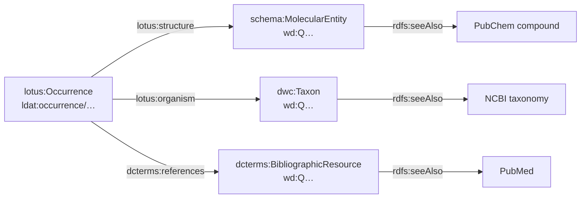

# LOTUS RDF schema (draft for RDF Portal)

Draft schema for hosting [LOTUS](https://lotus.nprod.net/) — referenced
structure–organism occurrences of natural products — as an RDF Portal database.
Written for the DBCLS staff who would load the graph and for whoever writes its
MIE file afterwards.

Status: **draft, not yet reviewed by DBCLS or by the LOTUS team.** Namespaces,
the graph name and the endpoint assignment are all proposals. See
[Open questions](#open-questions).

## Why convert the CSV instead of querying Wikidata

LOTUS data lives in Wikidata and LOTUS publishes no RDF of its own — its
releases are frozen CSV tables on Zenodo (v11 = 2026-04-13, DOI
[10.5281/zenodo.19360665](https://doi.org/10.5281/zenodo.19360665), CC-BY-4.0),
regenerated from live Wikidata by the project's own `lotus_exporter.py`.

Querying Wikidata live was measured and rejected for three reasons:

* **No graph to pin.** LOTUS is not a named graph in Wikidata but a query
  pattern (a compound with an InChIKey, a `P703` "found in taxon" statement, a
  `P248` reference on that statement). TogoMCP's correctness convention —
  every query pins its graph — has nothing to pin, and the subset boundary is
  a pattern that also admits non-LOTUS community edits.
* **Timeouts.** Wikidata's endpoint cuts every query at 60 s. Six of twelve of
  LOTUS's own published example queries hit that limit on 2026-09-15.
* **No version.** The live data has no version string, so an answer cannot be
  reproduced or cited. The frozen CSV has both a version and a date.

A converted graph fixes all three: one named graph, DBCLS-controlled
performance, and a `pav:version` in the data.

## A release ships two tables, and they disagree

The metadata table carries every attribute, but the **core table is
authoritative for which triples the release contains**. In v11 the core table
holds 48 `(structure, organism, reference)` triples the metadata table never
mentions, and flags 2 manually-validated triples the metadata table leaves
unflagged. The metadata table contains nothing the core table omits.

So a conversion needs both files: `--metadata` for the attributes, `--core` for
completeness. Converting from the metadata table alone loses those 48
occurrences with no error and no warning — 0.007% of the data, which is exactly
the size of defect that never gets noticed.

Entities reached only through the core table are thin: it carries just an
InChIKey, an organism name and a DOI. That is the deliberate trade — an
occurrence with three attributes can be enriched later, a missing one is
invisible.

## Identity and namespaces

| Prefix | IRI | Use |
| --- | --- | --- |
| `schema:` | `https://schema.org/` | structure class and chemical identifiers |
| `dwc:` | `http://rs.tdwg.org/dwc/terms/` | organism class and taxonomic ranks |
| `dcterms:` | `http://purl.org/dc/terms/` | reference class, bibliographic metadata |
| `bibo:` | `http://purl.org/ontology/bibo/` | DOI and PMID literals |
| `lotus:` | `http://purl.jp/bio/lotus/ontology/` | only what has no standard equivalent |
| `ldat:` | `http://rdfportal.org/dataset/lotus/` | minted occurrence IRIs |
| `wd:` | `http://www.wikidata.org/entity/` | structures, organisms, references |

**Standard vocabularies are reused wherever one fits.** Of the 43 fields the
converter emits, 20 carry a Schema.org, Darwin Core, Dublin Core or BIBO
predicate and 4 are `rdfs:seeAlso` links, leaving 19 in the LOTUS namespace —
only those with no standard equivalent. Near-misses were left unmapped rather
than forced: exact mass is not `schema:molecularWeight`, and a full species name
is not a `dwc:specificEpithet`.

Named graph: `http://rdfportal.org/dataset/lotus`

**Entities keep their Wikidata IRIs.** A structure is `wd:Q100138042`, not a
minted LOTUS IRI. This is the single most important decision in the schema: it
makes the graph joinable to Wikidata and to IDSM's Wikidata compound mirror
(already in TogoMCP as `idsm`) with no mapping table, and it survives a
re-conversion of a later release unchanged.

Only occurrences are minted, deterministically from the three QIDs:

```
ldat:occurrence/Q100138042_Q1709343_Q44391663
```

so re-running the converter on the same release reproduces byte-identical IRIs,
and two releases can be diffed directly.

## Model



An **occurrence** is the unit of assertion: *this structure was reported in this
organism by this reference*. It is a first-class node rather than a
`structure → organism` edge because the reference is not decoration — it is the
evidence, and the same structure–organism pair is typically reported by several
papers (672,413 occurrences over 227,256 structures and 37,486 organisms in
v11).

### `lotus:Occurrence`

| Property | Range | Notes |
| --- | --- | --- |
| `lotus:structure` | `schema:MolecularEntity` | exactly 1, `owl:FunctionalProperty` |
| `lotus:organism` | `dwc:Taxon` | exactly 1, `owl:FunctionalProperty` |
| `dcterms:references` | `dcterms:BibliographicResource` | exactly 1 by construction; cardinality not asserted, the predicate is Dublin Core's |
| `lotus:manuallyValidated` | `xsd:boolean` | **emitted only when true** (178 of 672,413 in v11) |

`lotus:Occurrence` is the one class still in the LOTUS namespace. A
literature-supported compound–taxon association is not a Darwin Core
`Occurrence` — that term means an organism observed at a place and time — so
reusing it would assert something false.

`manual_validation` is `Y` or `NA` in the CSV, where `NA` means "not manually
checked", not "checked and rejected". Emitting `false` for it would assert
something the source does not say, so the property is absent instead. Any query
counting validated occurrences must therefore not expect it on every node.

### `schema:MolecularEntity` (subject: `wd:Q…`)

Coverage is the share of the 227,256 structures carrying the property.

| Property | Range | Coverage |
| --- | --- | --- |
| `schema:inChIKey` | `xsd:string` | 100% |
| `schema:inChI` | `xsd:string` | 100% |
| `schema:smiles` | `xsd:string` | 100%, isomeric |
| `lotus:smiles2D` | `xsd:string` | 100%, kept separate from `schema:smiles` — it is the same molecule with stereochemistry removed |
| `schema:molecularFormula` | `xsd:string` | 100% |
| `lotus:exactMass` | `xsd:decimal` | 100%, **not** `schema:molecularWeight` — monoisotopic exact mass is a different quantity |
| `lotus:stereocenterCount` / `lotus:unspecifiedStereocenterCount` | `xsd:integer` | 100% |
| `lotus:xlogp` | `xsd:decimal` | 99.7% |
| `rdfs:label` | `xsd:string` | 96.9%, the traditional name |
| `schema:iupacName` | `xsd:string` | 96.6% |
| `lotus:npclassifierPathway` / `…Superclass` / `…Class` | `xsd:string` | 97.1% / 91.5% / 88.6%, **repeatable** |
| `lotus:classyfireKingdom` / `…Superclass` / `…Class` / `…DirectParent` | `xsd:string` | 98.6% / 98.6% / 97.9% / 83.2% |
| `lotus:chemontId` | `xsd:string` | 98.6%, as `CHEMONTID:0002518` |
| `rdfs:seeAlso` | IRI | 97.3%, `http://rdf.ncbi.nlm.nih.gov/pubchem/compound/CID<n>` |

The PubChem link uses the **RDF** IRI, the form the `pubchem` and `idsm` graphs
key on, so a federated join needs no string rewriting. The predicate is
`rdfs:seeAlso` and not `skos:exactMatch`: exactMatch is a SKOS concept-mapping
predicate and asserts more than a cross-reference should. The two are
independent — the predicate states the strength of the claim, the IRI decides
whether the claim is usable — and a brief period where the object was the
PubChem *web* IRI silently broke the join on 97.3% of structures.

The CID is no longer also emitted as a literal. Derive it from the link, or join
on `dcterms:identifier` in the `pubchem` graph, which carries the bare CID.

The three NPClassifier properties are **repeatable**: a compound with a mixed
biosynthetic origin packs its classes into one CSV cell as
`Fatty acids $ Polyketides` (up to 11.6% of rows), and the converter splits
them into separate triples. A query filtering on a single value therefore
matches co-classified compounds too — which is the correct behavior, and the
opposite of what the raw CSV gives you.

`lotus:chemontId` stays a literal because ChemOnt has no agreed resolvable IRI
namespace, and because a classification id is not an identifier *of* the
compound — it names a class the compound belongs to. Minting an IRI for it is an
open question below.

### `dwc:Taxon` (subject: `wd:Q…`)

Coverage is the share of the 37,486 organisms carrying the property.

| Property | Range | Coverage |
| --- | --- | --- |
| `dwc:scientificName` | `xsd:string` | 100%, also `rdfs:label` |
| `dwc:kingdom` … `dwc:genus` | `xsd:string` | seven ranks, 0.7–97.2%, see below |
| `lotus:taxonDomain` / `lotus:taxonSpecies` / `lotus:taxonVarietas` | `xsd:string` | the three ranks Darwin Core has no term for |
| `rdfs:seeAlso` | IRI | **78.0%**, `http://identifiers.org/taxonomy/<taxid>` |
| `rdfs:seeAlso` | IRI | 98.1%, `https://www.gbif.org/species/<id>` |
| `rdfs:seeAlso` | IRI | 97.8%, `https://tree.opentreeoflife.org/taxonomy/browse?id=<id>` |

The three external taxonomy ids are **links, not literals**: an id that
identifies a record in another resource is a pointer to that resource, not a
property of the Wikidata subject. All three share `rdfs:seeAlso`, so a query
wanting one specific authority must filter on the IRI prefix rather than on the
predicate.

**Only 78% of organisms have an NCBI taxon id**, so a query that joins through
the `identifiers.org/taxonomy/` link into the `taxonomy` database silently drops
8,252 organisms. Prefer GBIF or OTT coverage when completeness matters more than
reaching the NCBI tree, and say which one an answer used. (Per *row* the NCBI
figure looks like 86.6%; the well-studied organisms appear in many more rows.
Per-entity is the honest number.)

The rank path is ten flat properties carrying **names, not IRIs**, because that
is all the CSV has. Seven take their Darwin Core term (`dwc:kingdom`,
`dwc:phylum`, `dwc:class`, `dwc:order`, `dwc:family`, `dwc:tribe`,
`dwc:genus`); `lotus:taxonDomain`, `lotus:taxonSpecies` and
`lotus:taxonVarietas` stay local because Darwin Core has no matching term —
`dwc:specificEpithet` is the epithet alone, not the full species name LOTUS
supplies, so mapping onto it would change what the value means. Coverage is uneven by rank — `taxonTribe` is
present on 44.7% of organisms and `taxonVarietas` on 0.7% — so a clade rollup should
group on the rank it actually needs and treat absence as unknown, not as
exclusion.

For real hierarchy traversal, join the `identifiers.org/taxonomy/` link into
RDF Portal's `taxonomy` database and walk `rdfs:subClassOf*` there. That graph
keys on both this form and DDBJ's, so the link joins as emitted. That is the intended
division of labor: LOTUS supplies occurrences, `taxonomy` supplies the tree.

### `dcterms:BibliographicResource` (subject: `wd:Q…`)

Coverage is the share of the 91,426 references carrying the property.

| Property | Range | Coverage |
| --- | --- | --- |
| `bibo:doi` | `xsd:string` | 99.96% (91,386 of 91,426) |
| `rdfs:seeAlso` | IRI | 100%, `https://doi.org/<doi>`, percent-encoded |
| `dcterms:title` | `xsd:string` | 99.7%, `--refs-nt` only, also `rdfs:label` |
| `dcterms:isPartOf` | IRI (`wd:Q…`) | 99.2%, `--refs-nt` only |
| `dcterms:issued` | `xsd:date` | 99.1%, `--refs-nt` only |
| `bibo:pmid` | `xsd:string` | 47.1%, `--refs-nt` only |
| `rdfs:seeAlso` | IRI | 47.1%, `http://rdf.ncbi.nlm.nih.gov/pubmed/<pmid>` |
| `rdfs:seeAlso` | IRI | 5.0%, `https://pmc.ncbi.nlm.nih.gov/articles/PMC<n>/`, `--refs-nt` only |

DOI and PMID stay **literals** under BIBO, which is what those properties are
for, and each also gets a resolvable `rdfs:seeAlso`. The PMCID is only a link:
BIBO has no term for it, and it was never worth a LOTUS one.

Fewer than half the references carry a PMID, so joining LOTUS to RDF Portal's
`pubmed` database reaches at most 43,075 of the 91,426 papers. The DOI is the
complete identifier here; the PMID is the joinable one.

Titles, dates and PMIDs are **not in the CSV**, despite the Zenodo description
claiming the metadata table carries PMID and PMCID. They are folded in from a
Wikidata export by `--refs-nt`; without it, references have only a DOI.

Percent-encoding the DOI IRI is not cosmetic: Wiley DOIs such as
`10.1002/1099-0690(200104)2001:8<1459::AID-EJOC1459>3.0.CO;2-0` contain `<`
and `>`, which terminate an N-Triples IRI early. Two lines in nine million were
malformed before this was fixed, and every one of the other 9,094,796 parsed
fine — exactly the kind of defect a spot check misses.

## Vocabulary

The 19 remaining `lotus:` terms are defined inline by the converter's
`builtin_ontology()` — `rdfs:label`, `rdfs:comment`, `rdfs:domain` and
`rdfs:range` on one class (`lotus:Occurrence`) and 19 properties, 100 triples in
all — and it emits them **into this same named graph, by default**. The other 24
fields carry Schema.org, Darwin Core, Dublin Core or BIBO predicates, which those
vocabularies define; re-stating their definitions here would be both redundant
and a place for them to go stale.

`rdfs:isDefinedBy` is dropped on emit: the graph *is* the definition for these
terms, so pointing at an external document would be a promise the graph cannot
keep.

[lotus_ontology.ttl](lotus_ontology.ttl) is the **pre-remapping** vocabulary,
kept for reference only. It is in the retired `http://rdfportal.org/ontology/lotus#`
namespace and the converter rejects it if passed to `--ontology`, because loading
it would re-attach obsolete domain and range constraints to the reused standard
terms. `--ontology PATH` now *adds* a vocabulary to the builtin one rather than
replacing it.

They go in the data graph rather than a graph of their own because every
TogoMCP query pins its graph: a vocabulary in a second graph is invisible under
that pin, so schema discovery through SPARQL (`?p rdfs:comment ?c`) would
return 0 rows and the properties would look undocumented. RDF Portal's
`taxonomy` graph already does it this way, carrying the DDBJ taxonomy TBox
inline with 2.8 M instance triples (1 `owl:Ontology`, 4 `owl:Class`, 7
`owl:ObjectProperty`, 28 `owl:DatatypeProperty`, checked live 2026-09-16). The
portal does host standalone ontology graphs at
`http://rdfportal.org/ontology/<name>` — `go`, `mondo`, `hp`, `efo`, `uberon`
and the rest — but those are third-party ontologies with an independent
existence and many consumers; this one is private to a single graph.

The comments carry the traps, so an agent reading the schema through SPARQL
learns the same things the MIE file will tell it:

* `lotus:manuallyValidated` is **absent, not false**, when an occurrence was
  not checked — so count unvalidated occurrences by absence, never by `false`.
* The NCBI taxonomy link reaches only 78.0% of organisms, so the `taxonomy` join
  drops 8,252 of them silently.
* The three `lotus:npclassifier*` properties are **repeatable**, and are
  deliberately not declared `owl:FunctionalProperty`. The only functional
  properties are `lotus:structure` and `lotus:organism`, single-valued by
  construction. `schema:inChIKey` is repeatable too (87 structures in v11), but
  its cardinality is Schema.org's to state, not ours — a reused term must not be
  re-declared locally, which is the whole point of reusing it.

The vocabulary carries no `owl:versionInfo` and no `owl:Ontology` header: with
the definitions inline in the converter they version with the converter, and a
separate version string would be a second number to keep in sync. The release's
own `pav:version` remains on the dataset node below.

### Dataset metadata

```turtle
<http://rdfportal.org/dataset/lotus> a void:Dataset ;
    dcterms:title "LOTUS natural products occurrences" ;
    pav:version "v11" ;
    dcterms:issued "2026-04-13"^^xsd:date ;
    pav:retrievedFrom <https://doi.org/10.5281/zenodo.19360665> ;
    pav:createdOn "2026-09-16T00:14:19Z"^^xsd:dateTime ;
    void:sparqlEndpoint <https://rdfportal.org/primary/sparql> .
```

This block is the reason for the whole exercise. A 2026 survey of RDF Portal
found only 13 of 37 databases exposing any version string; LOTUS should ship
with one from day one, so an answer can be attributed to a release.

## Example instance

```turtle
ldat:occurrence/Q100138042_Q1709343_Q44391663
    a lotus:Occurrence ;
    lotus:structure    wd:Q100138042 ;
    lotus:organism     wd:Q1709343 ;
    dcterms:references wd:Q44391663 .

wd:Q100138042 a schema:MolecularEntity ;
    rdfs:label "(+)-Annonacin" ;
    schema:inChIKey "MBABCNBNDNGODA-WGCJABNLSA-N" ;
    schema:molecularFormula "C37H66O7" ;
    lotus:exactMass "622.48085444"^^xsd:decimal ;
    lotus:npclassifierPathway "Polyketides" ;
    lotus:npclassifierClass "Acetogenins" ;
    rdfs:seeAlso <http://rdf.ncbi.nlm.nih.gov/pubchem/compound/CID441555> .

wd:Q1709343 a dwc:Taxon ;
    rdfs:label "Annona muricata" ;
    dwc:scientificName "Annona muricata" ;
    dwc:family "Annonaceae" ;
    rdfs:seeAlso <http://identifiers.org/taxonomy/13337> .

wd:Q44391663 a dcterms:BibliographicResource ;
    bibo:doi "10.1055/S-2003-38485" ;
    bibo:pmid "12677528" ;
    dcterms:issued "2003-03-01"^^xsd:date ;
    rdfs:seeAlso <http://rdf.ncbi.nlm.nih.gov/pubmed/12677528> .
```

## Example queries

All four were run against the converted v11 graph and return rows. They are
written against the **pre-remapping** predicates below only where noted — each
has been retargeted at the current model, but none has been re-run since the
remapping, because that needs a fresh conversion of the 1.3 GB source.

```sparql
# Compounds reported in Annona muricata, with the paper that reports each
PREFIX lotus: <http://purl.jp/bio/lotus/ontology/>
PREFIX dcterms: <http://purl.org/dc/terms/>
PREFIX schema: <https://schema.org/>
PREFIX bibo: <http://purl.org/ontology/bibo/>
PREFIX rdfs: <http://www.w3.org/2000/01/rdf-schema#>
SELECT ?name ?inchikey ?doi
FROM <http://rdfportal.org/dataset/lotus>
WHERE {
  ?occ lotus:organism <http://www.wikidata.org/entity/Q1709343> ;
       lotus:structure ?s ; dcterms:references ?ref .
  ?s schema:inChIKey ?inchikey ; rdfs:label ?name .
  ?ref bibo:doi ?doi .
}
```

```sparql
# Biosynthetic profile of a plant family: which pathways, how many structures
PREFIX lotus: <http://purl.jp/bio/lotus/ontology/>
PREFIX dwc: <http://rs.tdwg.org/dwc/terms/>
SELECT ?pathway (COUNT(DISTINCT ?s) AS ?structures)
FROM <http://rdfportal.org/dataset/lotus>
WHERE {
  ?org dwc:family "Annonaceae" .
  ?occ lotus:organism ?org ; lotus:structure ?s .
  ?s lotus:npclassifierPathway ?pathway .
}
GROUP BY ?pathway ORDER BY DESC(?structures)
```

```sparql
# Which organisms produce a given compound, and how well evidenced is each claim
PREFIX lotus: <http://purl.jp/bio/lotus/ontology/>
PREFIX dcterms: <http://purl.org/dc/terms/>
PREFIX schema: <https://schema.org/>
PREFIX rdfs: <http://www.w3.org/2000/01/rdf-schema#>
SELECT ?organism ?name (COUNT(DISTINCT ?ref) AS ?papers)
FROM <http://rdfportal.org/dataset/lotus>
WHERE {
  ?s schema:inChIKey "MBABCNBNDNGODA-WGCJABNLSA-N" .
  ?occ lotus:structure ?s ; lotus:organism ?organism ; dcterms:references ?ref .
  ?organism rdfs:label ?name .
}
GROUP BY ?organism ?name ORDER BY DESC(?papers)
```

```sparql
# Cross-database: LOTUS occurrences joined to the taxonomy tree in RDF Portal
PREFIX lotus: <http://purl.jp/bio/lotus/ontology/>
PREFIX rdfs: <http://www.w3.org/2000/01/rdf-schema#>
SELECT (COUNT(DISTINCT ?s) AS ?structures)
WHERE {
  GRAPH <http://rdfportal.org/dataset/lotus> {
    ?occ lotus:organism ?org ; lotus:structure ?s .
    ?org rdfs:seeAlso ?taxon .
    # An organism carries up to three rdfs:seeAlso links (NCBI, GBIF, OTT), so
    # the authority MUST be selected by IRI prefix — without this filter the
    # count triples rather than erroring.
    FILTER(STRSTARTS(STR(?taxon), "http://identifiers.org/taxonomy/"))
  }
  # Walk the tree in the taxonomy graph to roll up to any clade. Pin that graph
  # per the MIE file.
}
```

## Load notes

Output of one v11 conversion from both CSV tables, with reference metadata folded in:

| | |
| --- | --- |
| Triples | 9,138,012 at the **pre-remapping** model (9,137,722 data + 290 vocabulary). **Re-measure before quoting:** the vocabulary is now 100 triples, and the data count moved when the PubChem CID literal was dropped and the three taxon-id literals became links. |
| Occurrences | 672,413 |
| Structures / organisms / references | 227,256 / 37,486 / 91,426 |
| Size | ~1.3 GB N-Triples, ~111 MB gzipped (pre-remapping; the remapping changes it only marginally) |
| Conversion time | ~100 s, single process, stdlib only |

Validated with `rapper -i ntriples -c` (all 9,137,722 triples parse) and
`sort | uniq -d` (no duplicate lines). This is a small graph by RDF Portal
standards — roughly the size of one mid-tier existing database — so load cost
should not be a concern.

## Open questions

1. **Namespaces.** The term namespace is now
   `http://purl.jp/bio/lotus/ontology/`, which sidesteps the collision described
   in the old question 2 — RDF Portal uses `http://rdfportal.org/ontology/<name>`
   to *name ontology graphs*, so minting terms in that space was asking for
   confusion. `http://rdfportal.org/dataset/lotus` remains the graph name and
   still follows the `taxonomy` pattern, but DBCLS owns that space and should
   confirm. Whether `purl.jp` is the right home, and who administers the PURL,
   is for DBCLS and the LOTUS team — the team may prefer a `lotus.nprod.net`
   namespace they control.
2. **Reused-vocabulary choices.** Twenty fields now carry a Schema.org, Darwin
   Core, Dublin Core or BIBO predicate. The mappings that are plainly right
   (`schema:inChIKey`, `dwc:family`, `bibo:doi`) need no review; the ones worth a
   second opinion are where a near-miss was *declined* — exact mass kept out of
   `schema:molecularWeight`, the full species name kept out of
   `dwc:specificEpithet`, and the occurrence kept out of `dwc:Occurrence`. Each
   is defensible and each is arguable.
3. **Licence.** The LOTUS site says the data is CC0, while the Zenodo record for
   this export is tagged CC-BY-4.0. Worth confirming with the LOTUS team before
   the graph asserts either one; the converter currently asserts neither.
4. **ChemOnt IRIs.** `lotus:chemontId` is a literal. If a resolvable ChemOnt
   namespace is chosen, it can become an IRI and connect to ontology tooling.
5. **Endpoint.** `primary` is assumed. DBCLS decides.
6. **Refresh cadence.** LOTUS ships roughly one frozen release a year (v11
   followed v10 by the change report). A re-conversion per release, keeping the
   previous graph, would let queries cite a release — and the deterministic
   occurrence IRIs make the diff between two releases directly computable.
7. **Structure identity across releases.** 87 structure QIDs carry more than one
   InChIKey in v11 (max 3). The schema emits all of them rather than choosing,
   so `schema:inChIKey` is repeatable in rare cases. Consumers keying on InChIKey
   should be aware — and note that we do not declare that cardinality, since the
   term is Schema.org's.
